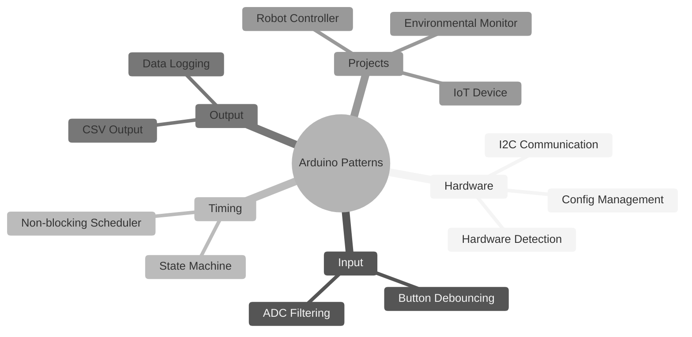
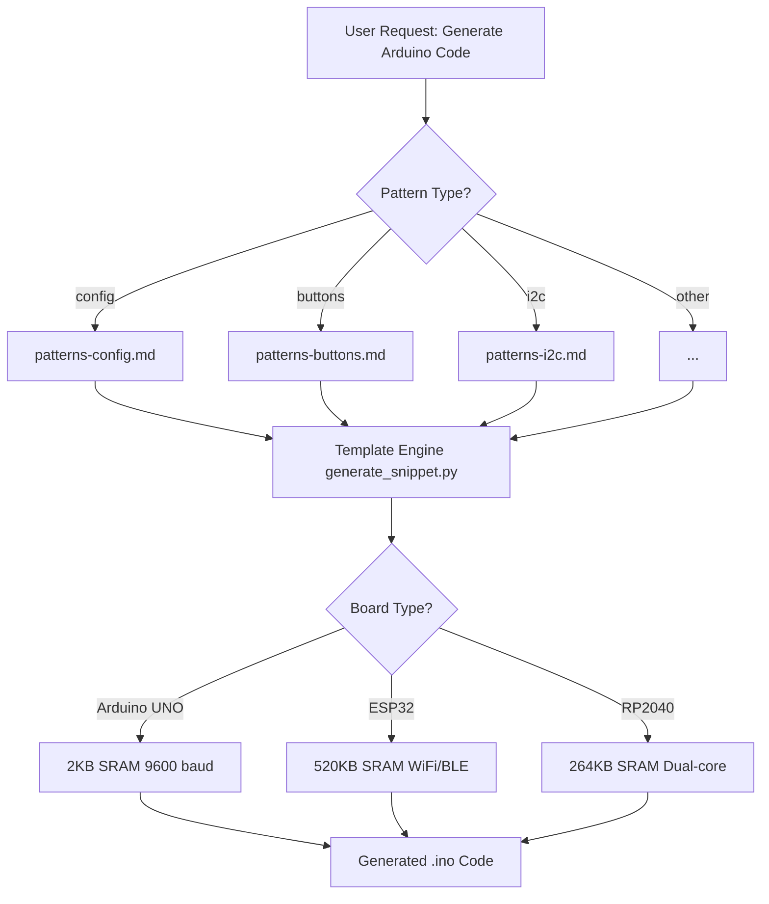
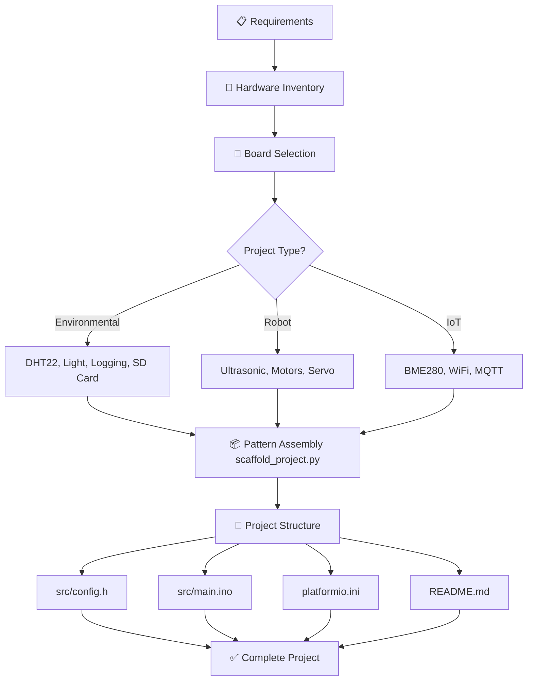

# arduino-skills


> Professional Arduino/embedded systems skills and maker tools for development, education, and prototyping.  
> v1.5.0 release prep: verification-first Arduino and maker skills for OTA deployment, calibration,
> field-power triage, and I2C bring-up.

## 📋 Table of Contents

- [arduino-skills](#arduino-skills)
  - [📋 Table of Contents](#-table-of-contents)
  - [🔍 Overview](#-overview)
  - [🤖 How Skills Work](#-how-skills-work)
  - [📦 Installation](#-installation)
    - [Quick Install (Recommended and Easiest)](#quick-install-recommended-and-easiest)
    - [Manual Setup](#manual-setup)
  - [🚀 Quick Start](#-quick-start)
    - [Generate Code Snippets](#generate-code-snippets)
    - [Scaffold Complete Projects](#scaffold-complete-projects)
  - [🔧 Arduino Core Skills](#-arduino-core-skills)
    - [Pattern Relationships](#pattern-relationships)
  - [🛠️ Maker Tools](#️-maker-tools)
    - [Tool Scripts](#tool-scripts)
  - [🏗️ Project Builders](#️-project-builders)
    - [Code Generator Workflow](#code-generator-workflow)
    - [Project Builder Workflow](#project-builder-workflow)
  - [📱 Platform Support](#-platform-support)
    - [Board-Specific Optimization](#board-specific-optimization)
  - [🏛️ Architecture](#️-architecture)
    - [Directory Structure](#directory-structure)
    - [Release And Tags](#release-and-tags)
    - [Design Principles](#design-principles)
  - [🤝 Contributing](#-contributing)
    - [Quick Submission Checklist](#quick-submission-checklist)
  - [📖 Documentation](#-documentation)
  - [📄 License](#-license)
  - [📋 Changelog](#-changelog)

---

## 🔍 Overview

This collection provides production-ready skills for Arduino and maker projects:

- **Arduino Core Skills** - Hardware patterns, timing, communication, FreeRTOS, and CLI workflows
- **Maker Tools** - Debugging, serial monitoring, BOM generation, power planning, documentation, diagrams
- **Project Builders** - Code generation and project scaffolding with automation scripts

All skills follow a consistent structure with:
- ✅ Copy-paste ready code that compiles without warnings
- ✅ Verification steps with expected outputs
- ✅ Common pitfalls with corrections
- ✅ Engineering rationale explaining "why"

---

## 🤖 How Skills Work

**arduino-skills** uses the **Agent Skills** open format for self-contained,
interoperable agent capabilities. Each skill is a folder containing:

- **SKILL.md** — Instructions with YAML frontmatter (`name`,
  `description`, optional spec fields)
- **scripts/** — Python automation tools with PEP 723 inline dependencies
- **references/** — Code examples, patterns, and templates
- **assets/** — Diagrams, datasheets, and resources

Skills follow progressive disclosure:

1. Discovery loads only `name` and `description`
2. Activation loads the main `SKILL.md`
3. Detailed references and scripts are loaded only when needed

The main `SKILL.md` should stay focused. Heavy examples, troubleshooting, and
deep reference material belong in `references/`, `scripts/`, or `assets/`.


---

## 📦 Installation

### Quick Install (Recommended and Easiest)

```bash
npx skills add wedsamuel1230/arduino-skills
```

### Manual Setup
1. **Clone the Repository**

```bash
git clone https://github.com/wedsamuel1230/arduino-skills.git
cd arduino-skills

```

2. **Copy Skills to Extensions Directory**
```bash
# Example: install into Codex's local skills directory
mkdir -p ~/.codex/skills

# Copy all skills
cp -r skills/* ~/.codex/skills/
```
---


## 🚀 Quick Start

### Generate Code Snippets

```bash
# List available patterns
uv run skills/arduino-code-generator/scripts/generate_snippet.py --list

# Generate I2C scanner for ESP32
uv run skills/arduino-code-generator/scripts/generate_snippet.py --pattern i2c --board esp32

# Interactive mode
uv run skills/arduino-code-generator/scripts/generate_snippet.py --interactive
```

### Scaffold Complete Projects

```bash
# List project types
uv run skills/arduino-project-builder/scripts/scaffold_project.py --list

# Create environmental monitor for ESP32
uv run skills/arduino-project-builder/scripts/scaffold_project.py \
    --type environmental --board esp32 --name "WeatherStation"

# Interactive mode
uv run skills/arduino-project-builder/scripts/scaffold_project.py --interactive
```

---

## 🔧 Arduino Core Skills

| Pattern | Path | Description |
|-------|------|-------------|
| Button Debouncing | `arduino-code-generator/` | Software debouncing with press/release/long-press detection |
| Config Management | `arduino-code-generator/` | Multi-board hardware abstraction with conditional compilation |
| CSV Output | `arduino-code-generator/` | Structured data logging for Serial/SD/Excel analysis |
| Data Logging | `arduino-code-generator/` | EEPROM with CRC, SD card CSV, wear leveling |
| ADC Filtering | `arduino-code-generator/` | Moving average, median, and Kalman filters for noisy sensors |
| Hardware Detection | `arduino-code-generator/` | Auto-detect boards, sensors, adaptive configuration |
| I2C Communication | `arduino-code-generator/` | Device scanning, address detection, bus diagnostics |
| Non-blocking Scheduler | `arduino-code-generator/` | millis()-based timing, priority task scheduling |
| State Machine | `arduino-code-generator/` | Enum-based FSM for complex behavior control |

### Pattern Relationships



---

## 🛠️ Maker Tools

| Skill | Path | Description |
|-------|------|-------------|
| Circuit Debugger | `circuit-debugger/` | 5-phase hardware debugging with multimeter guide |
| Error Explainer | `error-message-explainer/` | Compiler error interpretation with fixes |
| BOM Generator | `bom-generator/` | Bill of materials with supplier links, Excel export |
| Power Calculator | `power-budget-calculator/` | Current draw estimation, battery sizing |
| Battery Selector | `battery-selector/` | Chemistry comparison, charging solutions |
| Enclosure Designer | `enclosure-designer/` | OpenSCAD parametric templates, 3D print settings |
| README Generator | `readme-generator/` | Professional GitHub documentation |
| Code Review | `code-review-facilitator/` | 8-category review, code smell detection |
| Datasheet Interpreter | `datasheet-interpreter/` | PDF spec extraction from URLs |
| **Serial Monitor** | `arduino-serial-monitor/` | Enhanced serial debugging with real-time monitoring, data logging, filtering, and error detection |
| **Mermaid Generator** | `mermaid-diagram-generator/` | Visual documentation: state machines, timing, FreeRTOS |
| **OTA Deployment** | `ota-deployment-guardian/` | OTA-safe deployment workflows, network port recovery, and remote update guardrails |
| **Calibration Workbench** | `sensor-calibration-workbench/` | Calibration workflows, coefficient persistence, and drift checks for maker sensors |
| **Field Power Triage** | `field-power-and-connectivity-triager/` | USB-vs-field-power diagnosis for WiFi and sensor-heavy maker projects |
| **I2C Bringup** | `i2c-bringup-diagnostician/` | Fault isolation for I2C detection, library, pull-up, and board-quirk failures |

### Tool Scripts

All tools include Python scripts with PEP 723 inline dependencies:

```bash
# Serial monitoring with filtering and error detection
uv run skills/arduino-serial-monitor/scripts/monitor_serial.py --port COM3 --detect-errors

# Power budget calculation
uv run skills/power-budget-calculator/scripts/calculate_power.py --interactive

# BOM generation to Excel
uv run skills/bom-generator/scripts/generate_bom.py --output bom.xlsx

# Extract specs from datasheet PDF
uv run skills/datasheet-interpreter/scripts/extract_specs.py \
    --url "https://example.com/sensor-datasheet.pdf"
```

---

## 🏗️ Project Builders

### Code Generator Workflow



### Project Builder Workflow



---

## 📱 Platform Support

| Platform | SRAM | Features | Skills Supported |
|----------|------|----------|------------------|
| **Arduino UNO/Nano** | 2KB | Basic I/O, ADC | All (with F() macro) |
| **ESP32** | 520KB | WiFi, BLE, dual-core, FreeRTOS | All + IoT projects |
| **RP2040 (Pico)** | 264KB | Dual-core, PIO, USB host | All (no WiFi unless Pico W) |

### Board-Specific Optimization


|Arduino UNO (2KB)     |ESP32 (520KB)       |RP2040(264KB)   |
|----------------------|--------------------|----------------|
| F() for strings      | WiFi/BLE patterns  | Multicore tasks|
| Small buffers        | FreeRTOS tasks     | PIO for timing |
| Avoid String class   | Large JSON buffers | USB host mode  |
| 9600 baud            | 115200 baud        | 115200 baud    |


---

## 🏛️ Architecture

### Directory Structure

```
.
├── README.md
├── CONTRIBUTING.md
├── DEVELOPMENT.md
├── CHANGELOG.md
├── arduino-skills.md
├── docs/
│   ├── board-support/                # Shared board-family support references
│   ├── diagrams/                     # Mermaid diagram sources
│   ├── research/                     # Archived discovery and pain-point research
│   └── workflows/                    # Archived PRD, plan, and test-map artifacts
├── scripts/
│   └── validate_agent_skills.py      # Repo-local skill conformance validator
└── skills/
    ├── arduino-code-generator/
    ├── arduino-project-builder/
    ├── arduino-cli-skill/
    ├── ota-deployment-guardian/
    ├── sensor-calibration-workbench/
    ├── field-power-and-connectivity-triager/
    ├── i2c-bringup-diagnostician/
    └── ...                           # Remaining Arduino and maker skills
```

### Release And Tags

`SKILL.md` is the canonical source of truth for skill authoring and discovery.
Before publishing a release, run:

```bash
python3 scripts/validate_agent_skills.py
```

For the current release prep, the intended tag is:

```bash
git tag -a v1.5.0 -m "Release v1.5.0"
git push origin v1.5.0
```

Suggested repository topics for hosting platforms:

- `arduino`
- `embedded`
- `agent-skills`
- `makers`
- `esp32`
- `rp2040`
- `uno-r4`
- `ota`
- `i2c`
- `calibration`

### Design Principles

All skills follow these rules from `arduino-skills.md`:

1. **Verifiable Output** - Every example includes test procedures and expected results
2. **Avoid delay() Blocking** - Use `millis()` and state machines for timing
3. **Hardware Abstraction** - All board-specific code in `config.h` with `#if defined()`

---

## 🤝 Contributing

We welcome contributions. Before you start, read:

- **[CONTRIBUTING.md](CONTRIBUTING.md)** — Skill submission process, code quality checklist, and pull request workflow
- **[DEVELOPMENT.md](DEVELOPMENT.md)** — Setup guide, skill creation walkthrough, and automation scripts

### Quick Submission Checklist

- [ ] Compiles without warnings on Arduino IDE
- [ ] Uses `unsigned long` for millis() timing
- [ ] Bounds checking on all arrays
- [ ] F() macro for string constants on UNO
- [ ] No hardcoded pins (use config.h)
- [ ] SKILL.md has complete sections and YAML frontmatter
- [ ] Tested on Arduino UNO, ESP32, RP2040 (or documented limitation)

See [CONTRIBUTING.md](CONTRIBUTING.md#submitting-a-new-skill) for the complete process.

---

## 📖 Documentation

| Document | Purpose |
|----------|---------|
| [README.md](README.md) | Main project documentation (this file) |
| [CONTRIBUTING.md](CONTRIBUTING.md) | Skill submission guidelines and checklist |
| [DEVELOPMENT.md](DEVELOPMENT.md) | Setup, skill creation, automation scripts |
| [arduino-skills.md](arduino-skills.md) | Design principles and constraints |
| [CHANGELOG.md](CHANGELOG.md) | Version history and release notes |
| [docs/research/](docs/research/) | Archived discovery notes and pain-point research |
| [docs/workflows/](docs/workflows/) | Archived PRD, plan, and verification artifacts |

---

## 📄 License

These skills are provided under the **MIT** license.  
Suitable for development, research, and prototyping.
See [LICENSE](LICENSE) for details.

## 📋 Changelog

See [CHANGELOG.md](CHANGELOG.md) for the complete version history and release notes.

---
