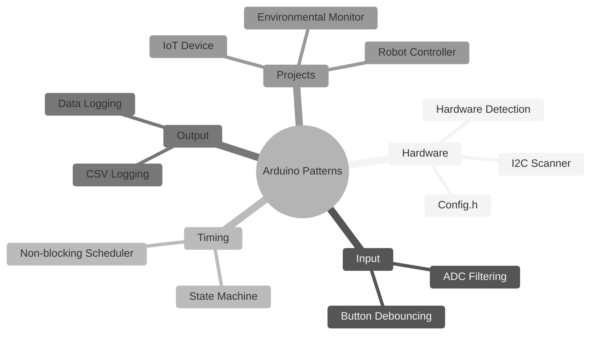
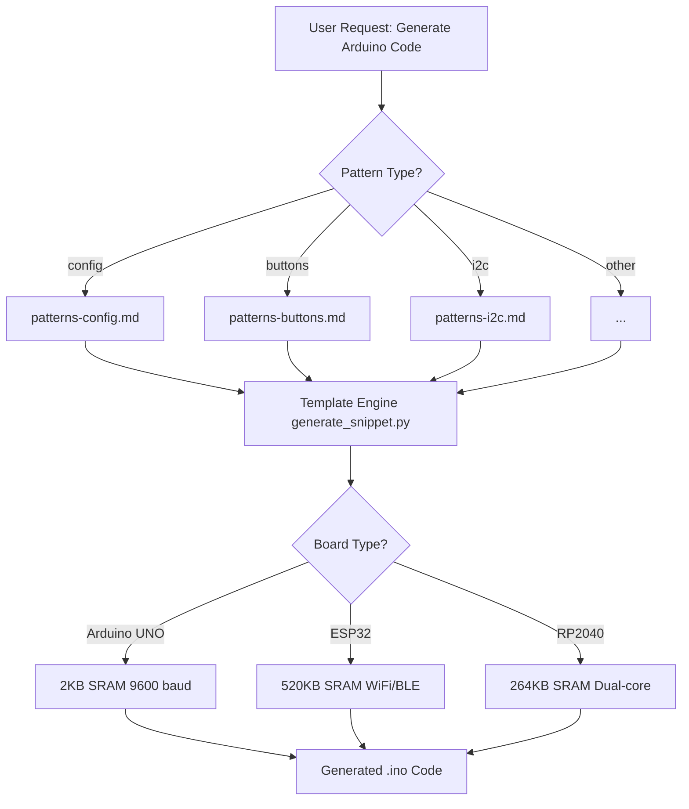
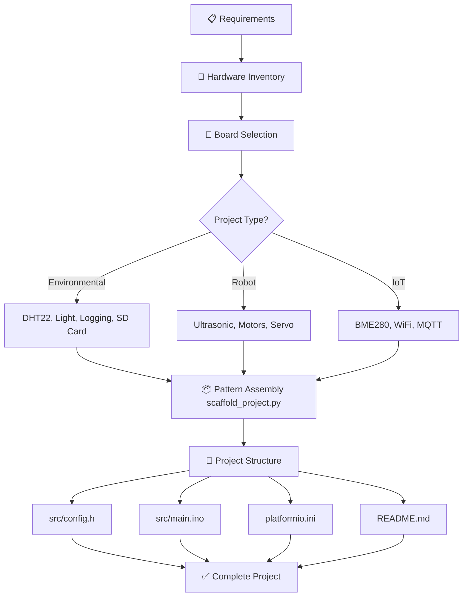

# arduino-skills


> Professional Arduino/embedded systems skills and maker tools for development, education, and prototyping.  
> **v1.1.0:** 9 production-ready Arduino example sketches added to arduino-code-generator with comprehensive documentation, wiring diagrams, and testing verification.

## 📋 Table of Contents

- [arduino-skills](#arduino-skills)
  - [📋 Table of Contents](#-table-of-contents)
  - [🔍 Overview](#-overview)
  - [🤖 How Skills Work](#-how-skills-work)
  - [📦 Installation](#-installation)
    - [📍 Marketplace Configuration](#-marketplace-configuration)
    - [Claude Code](#claude-code)
    - [Google Gemini CLI](#google-gemini-cli)
    - [VS Code Copilot](#vs-code-copilot)
  - [🚀 Quick Start](#-quick-start)
    - [Generate Code Snippets](#generate-code-snippets)
    - [Scaffold Complete Projects](#scaffold-complete-projects)
  - [🔧 Arduino Core Skills](#-arduino-core-skills)
    - [Pattern Relationships](#pattern-relationships)
  - [🛠️ Maker Tools](#️-maker-tools)
    - [Tool Scripts](#tool-scripts)
  - [🏗️ Project Builders](#️-project-builders)
    - [Code Generator Workflow](#code-generator-workflow)
    - [Project Builder Workflow](#project-builder-workflow)
  - [📱 Platform Support](#-platform-support)
    - [Board-Specific Optimization](#board-specific-optimization)
  - [🏛️ Architecture](#️-architecture)
    - [Directory Structure](#directory-structure)
    - [Marketplace Configuration](#marketplace-configuration)
    - [Design Principles](#design-principles)
  - [🤝 Contributing](#-contributing)
    - [Quick Submission Checklist](#quick-submission-checklist)
  - [📖 Documentation](#-documentation)
  - [📄 License](#-license)
  - [📋 Changelog](#-changelog)

---

## 🔍 Overview

This collection provides **20 production-ready skills** for Arduino and maker projects:

- **11 Arduino Core Skills** - Hardware patterns, timing, communication, FreeRTOS
- **9 Maker Tools** - Debugging, BOM generation, power planning, documentation, diagrams
- **2 Project Builders** - Code generation and project scaffolding with automation scripts

All skills follow a consistent structure with:
- ✅ Copy-paste ready code that compiles without warnings
- ✅ Verification steps with expected outputs
- ✅ Common pitfalls with corrections
- ✅ Engineering rationale explaining "why"

---

## 🤖 How Skills Work

**arduino-skills** uses the **Agent Context Protocol (ACP)** — a standard for self-contained, interoperable skill packages for AI/ML agents. Each skill is a folder containing:

- **SKILL.md** — Instructions with YAML frontmatter (name, description, trigger conditions)
- **scripts/** — Python automation tools with PEP 723 inline dependencies
- **references/** — Code examples, patterns, and templates
- **assets/** — Diagrams, datasheets, and resources


---

## 📦 Installation

| Agent | Setup | Marketplace | Docs |
|-------|-------|-------------|------|
| **Claude Code** | `/plugin marketplace add arduino-skills` | ✅ Configured (v1.1.0) | [Docs](https://code.claude.com/docs/en/skills) |
| **Google Gemini CLI** | `gemini extensions install` | ✅ Converted (11 extensions) | [Docs](https://geminicli.com/docs/) |
| **VS Code Copilot** | Copy to `.github/skills/` folder | ⚠️ Manual setup | [Docs](https://code.visualstudio.com/docs/copilot/customization/agent-skills) |

### 📍 Marketplace Configuration

All 11 skills include marketplace metadata for discovery and installation:
- **Claude Code:** `.claude-plugin/marketplace.json` — Enables `/plugin marketplace search` discovery
- **Gemini CLI:** `gemini-extension.json` — Auto-generated from skill-porter conversion (see `d:/projects/gemini-extensions/`)

Each marketplace file includes:
- ✅ Skill name and description (50+ characters)
- ✅ Version (1.1.0), license (MIT), and category tags
- ✅ Plugin metadata for discovery
- ✅ Compatible with skill-porter universal conversion tool

### Claude Code

**Requirements:** `marketplace.json` present in each skill's `.claude-plugin/` directory

```bash
# Register marketplace
/plugin marketplace add arduino-skills

# Install a skill (auto-discovers all 11)
/plugin install arduino-code-generator@arduino-skills

# Search available skills
/plugin search arduino
```

**What's configured:**
- ✅ All 11 skills have marketplace metadata
- ✅ Descriptions, tags, license, and version included
- ✅ Ready for official marketplace publication

### Google Gemini CLI

**Requirements:** Gemini extensions generated via skill-porter conversion (at `d:/projects/gemini-extensions/`)

```bash
# Install from local directory
gemini extensions install ./gemini-extensions/arduino-code-generator --consent

# Install from GitHub
gemini extensions install https://github.com/yourusername/arduino-skills/tree/main/gemini-extensions/arduino-code-generator --consent

# List installed extensions
gemini extensions list
```

**What's included:**
- ✅ 11 Gemini CLI extensions (auto-generated from skill-porter)
- ✅ Universal `gemini-extension.json` manifest format
- ✅ Full compatibility with Gemini's extension system

**Note on Multi-Platform Support:** This repository uses [skill-porter](https://github.com/jduncan-rva/skill-porter) to automatically convert between Claude SKILL.md and Gemini extension.json formats. Both versions are kept in sync.

### VS Code Copilot

Enable the chat.useAgentSkills setting to use Agent Skills

**Copy skill folder to extensions directory:**
```bash
mkdir -p .github/skills
cp -r arduino-code-generator .github/skills/arduino-code-generator
```

VS Code supports two locations:
- **Recommended:** `~/.github/skills/` (shared location)
- **Legacy:** `~/.claude/skills/` (backward compatible)

---

## 🚀 Quick Start

### Generate Code Snippets

```bash
# List available patterns
uv run arduino-code-generator/scripts/generate_snippet.py --list

# Generate I2C scanner for ESP32
uv run arduino-code-generator/scripts/generate_snippet.py --pattern i2c --board esp32

# Interactive mode
uv run arduino-code-generator/scripts/generate_snippet.py --interactive
```

### Scaffold Complete Projects

```bash
# List project types
uv run arduino-project-builder/scripts/scaffold_project.py --list

# Create environmental monitor for ESP32
uv run arduino-project-builder/scripts/scaffold_project.py \
    --type environmental --board esp32 --name "WeatherStation"

# Interactive mode
uv run arduino-project-builder/scripts/scaffold_project.py --interactive
```

---

## 🔧 Arduino Core Skills

| Skill | Path | Description |
|-------|------|-------------|
| Config.h Management | `arduino-config-management/` | Multi-board hardware abstraction with conditional compilation |
| ADC Filtering | `arduino-adc-filtering/` | Moving average, median, and Kalman filters for noisy sensors |
| Button Debouncing | `arduino-button-debouncing/` | Software debouncing with press/release/long-press detection |
| I2C Scanner | `arduino-i2c-scanner/` | Device scanning, address detection, bus diagnostics |
| CSV Output | `arduino-csv-output/` | Structured data logging for Serial/SD/Excel analysis |
| State Machine | `arduino-state-machine/` | Enum-based FSM for complex behavior control |
| Non-blocking Scheduler | `arduino-non-blocking-scheduler/` | millis()-based timing, priority task scheduling |
| Hardware Compatibility | `arduino-hardware-compatibility/` | Auto-detect boards, sensors, adaptive configuration |
| Data Logging | `arduino-data-logging/` | EEPROM with CRC, SD card CSV, wear leveling |
| **FreeRTOS Patterns** | `freertos-patterns/` | ESP32 multitasking, queues, mutexes, task notifications |
| **Code Generator** | `arduino-code-generator/` | Pattern-based snippet generation with Python automation |

### Pattern Relationships



---

## 🛠️ Maker Tools

| Skill | Path | Description |
|-------|------|-------------|
| Circuit Debugger | `circuit-debugger/` | 5-phase hardware debugging with multimeter guide |
| Error Explainer | `error-message-explainer/` | Compiler error interpretation with fixes |
| BOM Generator | `bom-generator/` | Bill of materials with supplier links, Excel export |
| Power Calculator | `power-budget-calculator/` | Current draw estimation, battery sizing |
| Battery Selector | `battery-selector/` | Chemistry comparison, charging solutions |
| Enclosure Designer | `enclosure-designer/` | OpenSCAD parametric templates, 3D print settings |
| README Generator | `readme-generator/` | Professional GitHub documentation |
| Code Review | `code-review-facilitator/` | 8-category review, code smell detection |
| Datasheet Interpreter | `datasheet-interpreter/` | PDF spec extraction from URLs |
| **Mermaid Generator** | `mermaid-diagram-generator/` | Visual documentation: state machines, timing, FreeRTOS |

### Tool Scripts

All tools include Python scripts with PEP 723 inline dependencies:

```bash
# Power budget calculation
uv run power-budget-calculator/scripts/calculate_power.py --interactive

# BOM generation to Excel
uv run bom-generator/scripts/generate_bom.py --output bom.xlsx

# Extract specs from datasheet PDF
uv run datasheet-interpreter/scripts/extract_specs.py \
    --url "https://example.com/sensor-datasheet.pdf"
```

---

## 🏗️ Project Builders

### Code Generator Workflow



### Project Builder Workflow



---

## 📱 Platform Support

| Platform | SRAM | Features | Skills Supported |
|----------|------|----------|------------------|
| **Arduino UNO/Nano** | 2KB | Basic I/O, ADC | All (with F() macro) |
| **ESP32** | 520KB | WiFi, BLE, dual-core, FreeRTOS | All + IoT projects |
| **RP2040 (Pico)** | 264KB | Dual-core, PIO, USB host | All (no WiFi unless Pico W) |

### Board-Specific Optimization


|Arduino UNO (2KB)     |ESP32 (520KB)       |RP2040(264KB)   |
|----------------------|--------------------|----------------|
| F() for strings      | WiFi/BLE patterns  | Multicore tasks|
| Small buffers        | FreeRTOS tasks     | PIO for timing |
| Avoid String class   | Large JSON buffers | USB host mode  |
| 9600 baud            | 115200 baud        | 115200 baud    |


---

## 🏛️ Architecture

### Directory Structure

```
skills/
├── arduino-code-generator/           # Code snippet generation
│   ├── SKILL.md
│   ├── .claude-plugin/
│   │   └── marketplace.json          # Claude marketplace config (NEW v0.9.0)
│   ├── references/                   # 9 pattern files
│   └── scripts/generate_snippet.py
│
├── arduino-project-builder/          # Project scaffolding
│   ├── SKILL.md
│   ├── .claude-plugin/
│   │   └── marketplace.json          # Claude marketplace config (NEW v0.9.0)
│   ├── references/                   # 3 project templates
│   └── scripts/scaffold_project.py
│
├── [arduino-*]/                      # Core skills (9 folders)
│   └── .claude-plugin/
│       └── marketplace.json          # Claude marketplace config (NEW v0.9.0)
│
├── [maker-tools]/                    # Maker tools (9 folders)
│   ├── .claude-plugin/
│   │   └── marketplace.json          # Claude marketplace config (NEW v0.9.0)
│   └── scripts/*.py                  # Automation scripts
│
├── gemini-extensions/                # Gemini CLI extensions (NEW v0.9.0)
│   └── [skill-name]/
│       ├── gemini-extension.json
│       └── GEMINI.md
│
├── docs/
│   └── diagrams/                     # Mermaid diagram sources
│
└── memory-bank/                      # Project tracking
    ├── projectbrief.md
    ├── activeContext.md
    └── SESSION.md
```

### Marketplace Configuration

**v1.1.0 Feature Release:** All 20 skills include marketplace metadata for discovery on Claude Code and Gemini CLI. arduino-code-generator now includes 9 production-ready example sketches with comprehensive documentation.

Each skill's `.claude-plugin/marketplace.json` includes:
```json
{
  "name": "skill-name",
  "metadata": {
    "description": "Full skill description (50+ characters)",
    "version": "0.9.0",
    "license": "MIT",
    "author": "arduino-skills contributors",
    "tags": ["arduino", "embedded-systems", "..."],
    "category": "embedded-systems | maker-tools"
  },
  "plugins": [
    {
      "name": "skill-name",
      "description": "Brief one-liner for discovery",
      "enabled": true
    }
  ]
}
```

**Multi-Platform Conversion:** Gemini extensions are auto-generated from these marketplace files using [skill-porter](https://github.com/jduncan-rva/skill-porter), which transforms:
- Claude `SKILL.md` → Gemini `gemini-extension.json`
- `allowed-tools` (whitelist) → `excludeTools` (blacklist)
- YAML metadata → JSON manifest

Both versions are validated and kept in sync via CI/CD.

### Design Principles

All skills follow these rules from `arduino-skills.md`:

1. **Verifiable Output** - Every example includes test procedures and expected results
2. **Avoid delay() Blocking** - Use `millis()` and state machines for timing
3. **Hardware Abstraction** - All board-specific code in `config.h` with `#if defined()`

---

## 🤝 Contributing

We welcome contributions! Before you start, please read:

- **[CONTRIBUTING.md](CONTRIBUTING.md)** — Skill submission process, code quality checklist, pull request workflow
- **[CODE_OF_CONDUCT.md](CODE_OF_CONDUCT.md)** — Community standards and expectations
- **[DEVELOPMENT.md](DEVELOPMENT.md)** — Setup guide, skill creation walkthrough, automation scripts

### Quick Submission Checklist

- [ ] Compiles without warnings on Arduino IDE
- [ ] Uses `unsigned long` for millis() timing
- [ ] Bounds checking on all arrays
- [ ] F() macro for string constants on UNO
- [ ] No hardcoded pins (use config.h)
- [ ] SKILL.md has complete sections and YAML frontmatter
- [ ] Tested on Arduino UNO, ESP32, RP2040 (or documented limitation)

See [CONTRIBUTING.md](CONTRIBUTING.md#submitting-a-new-skill) for the complete process.

---

## 📖 Documentation

| Document | Purpose |
|----------|---------|
| [README.md](README.md) | Main project documentation (this file) |
| [CONTRIBUTING.md](CONTRIBUTING.md) | Skill submission guidelines and checklist |
| [DEVELOPMENT.md](DEVELOPMENT.md) | Setup, skill creation, automation scripts |
| [SECURITY.md](SECURITY.md) | Security vulnerability reporting |
| [CODE_OF_CONDUCT.md](CODE_OF_CONDUCT.md) | Community standards |
| [arduino-skills.md](arduino-skills.md) | Design principles and constraints |
| [CHANGELOG.md](CHANGELOG.md) | Version history and release notes |

---

## 📄 License

These skills are provided under the **MIT** license.  
Suitable for development, research, and prototyping.
See [LICENSE](LICENSE) for details.

## 📋 Changelog

See [CHANGELOG.md](CHANGELOG.md) for the complete version history and release notes.

---