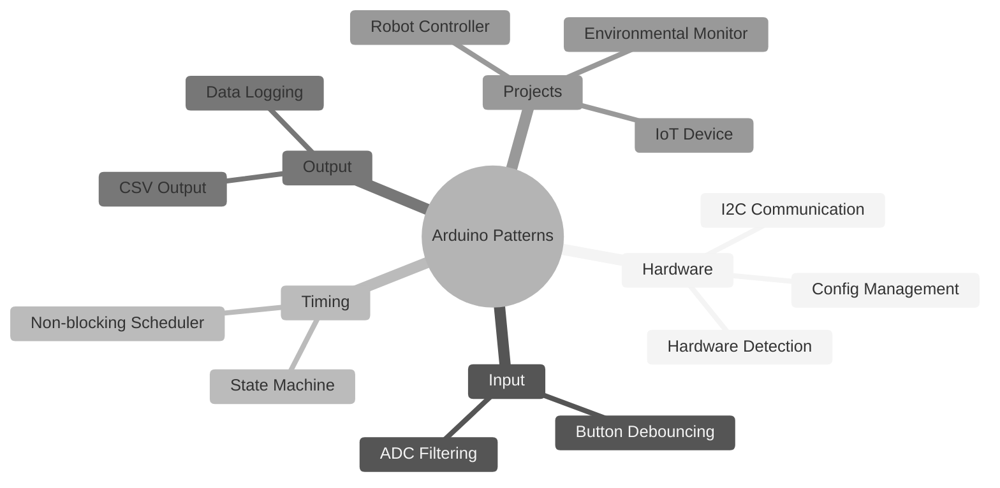
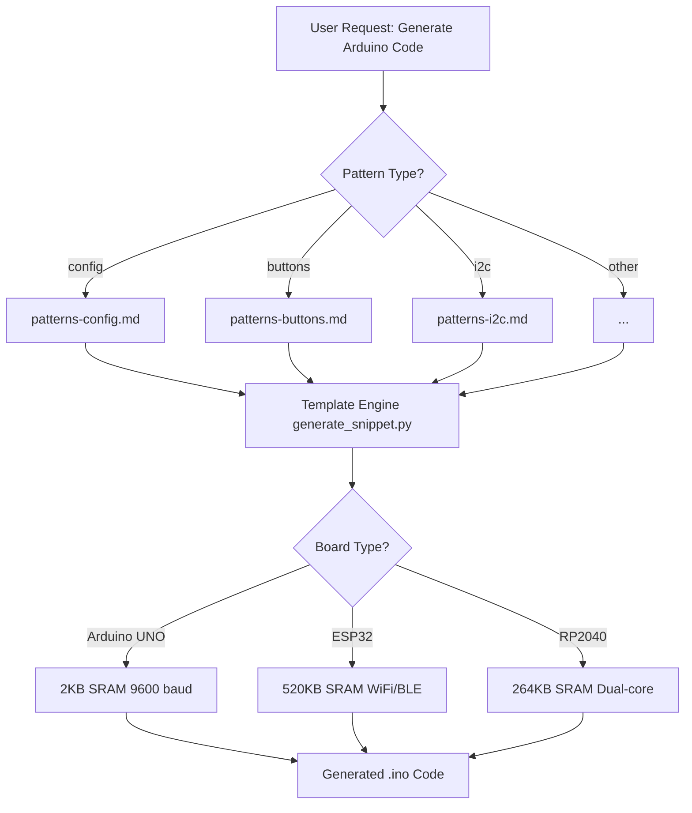
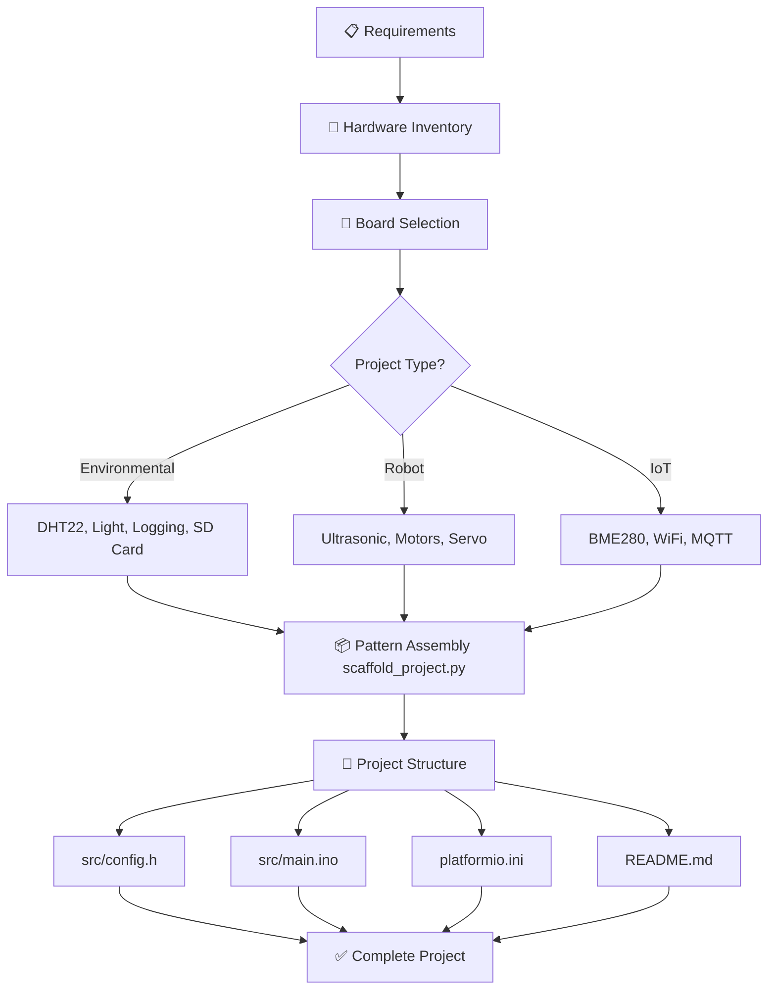

# arduino-skills


> Professional Arduino/embedded systems skills and maker tools for development, education, and prototyping.  
> v1.7.0: toolchain-neutral,
> board-aware Arduino skills with plugin packaging,
> physical-world evidence gates, and composable lifecycle workflows for OTA deployment, calibration,
> field-power triage, and I2C bring-up.

## 📋 Table of Contents

- [arduino-skills](#arduino-skills)
  - [📋 Table of Contents](#-table-of-contents)
  - [🔍 Overview](#-overview)
  - [🤖 How Skills Work](#-how-skills-work)
  - [📦 Installation](#-installation)
    - [Quick Install (Recommended and Easiest)](#quick-install-recommended-and-easiest)
    - [Manual Setup](#manual-setup)
  - [🚀 Quick Start](#-quick-start)
    - [Generate Code Snippets](#generate-code-snippets)
    - [Scaffold Complete Projects](#scaffold-complete-projects)
  - [🔧 Arduino Core Skills](#-arduino-core-skills)
    - [Pattern Relationships](#pattern-relationships)
  - [🛠️ Maker Tools](#️-maker-tools)
    - [Tool Scripts](#tool-scripts)
  - [🏗️ Project Builders](#️-project-builders)
    - [Code Generator Workflow](#code-generator-workflow)
    - [Project Builder Workflow](#project-builder-workflow)
  - [📱 Platform Support](#-platform-support)
    - [Board-Specific Optimization](#board-specific-optimization)
  - [🏛️ Architecture](#️-architecture)
    - [Directory Structure](#directory-structure)
    - [Release And Tags](#release-and-tags)
    - [Design Principles](#design-principles)
  - [🤝 Contributing](#-contributing)
    - [Quick Submission Checklist](#quick-submission-checklist)
  - [📖 Documentation](#-documentation)
  - [📄 License](#-license)
  - [📋 Changelog](#-changelog)

---

## 🔍 Overview

This collection provides production-ready skills for Arduino and maker projects:

- **Arduino Core Skills** - Hardware patterns, timing, communication, FreeRTOS, and CLI workflows
- **Maker Tools** - Debugging, serial monitoring, BOM generation, power planning, documentation, diagrams
- **Project Builders** - Code generation and project scaffolding with automation scripts
- **Board Support** - AI-facing exact-board lookup, source status, capability tags, and safe pin handoff
- **Workflow Router** - Board/toolchain intake and combined firmware, electronics, power, networking, enclosure, and deployment workflows

The workflow is toolchain-neutral across Arduino IDE, Arduino CLI, PlatformIO,
and vendor-specific tools. The exact board, framework, versions, and hardware
evidence determine what can be claimed for a task.

All skills follow a consistent structure with:
- ✅ Copy-paste ready code that compiles without warnings
- ✅ Verification steps with expected outputs
- ✅ Common pitfalls with corrections
- ✅ Engineering rationale explaining "why"

---

## 🤖 How Skills Work

**arduino-skills** uses the **Agent Skills** open format for self-contained,
interoperable agent capabilities. Each skill is a folder containing:

- **SKILL.md** — Instructions with YAML frontmatter (`name`,
  `description`, optional spec fields)
- **scripts/** — Python automation tools with PEP 723 inline dependencies
- **references/** — Code examples, patterns, and templates
- **assets/** — Diagrams, datasheets, and resources

Skills follow progressive disclosure:

1. Discovery loads only `name` and `description`
2. Activation loads the main `SKILL.md`
3. Detailed references and scripts are loaded only when needed

The main `SKILL.md` should stay focused. Heavy examples, troubleshooting, and
deep reference material belong in `references/`, `scripts/`, or `assets/`.

For a complete request, start with `arduino-workflow-router`. For any request
that spans physical hardware, recovery, measurements, or multiple sessions,
load `embedded-project-loop` first. It creates the durable goal, one next todo,
evidence ledger, rollback path, and user-owned physical gate before the router
composes specialists. For a named board reference or capability lookup, start
with `board-support`; for choosing or replacing a board from requirements, use
`board-selection`. Neither entry point assumes Arduino IDE, a particular
board family, or a successful compile as proof of system behavior.


---

## 📦 Installation

### Quick Install (Recommended and Easiest)

```bash
npx skills add wedsamuel1230/arduino-skills
```

### Plugin Hosts

The repository has one shared `skills/` source of truth and thin adapters for
the major hosts:

| Host | Install or test command | Adapter |
|---|---|---|
| Agent Skills CLI | `npx skills add wedsamuel1230/arduino-skills` | `skills/` |
| Codex | `codex plugin marketplace add /path/to/arduino-skills` then `codex plugin add arduino-skills@arduino-skills` | `.codex-plugin/` |
| Claude Code | `claude --plugin-dir /path/to/arduino-skills` | `.claude-plugin/` |
| Cursor | Open/install the repo as a plugin | `.cursor-plugin/` |

See [docs/plugin-distribution.md](docs/plugin-distribution.md) for published
marketplace flows, wrapper conventions, and validation commands.

### Manual Setup
1. **Clone the Repository**

```bash
git clone https://github.com/wedsamuel1230/arduino-skills.git
cd arduino-skills

```

2. **Copy Skills to Extensions Directory**
```bash
# Example: install into Codex's local skills directory
mkdir -p ~/.codex/skills

# Copy all skills
cp -r skills/* ~/.codex/skills/
```
---


## 🚀 Quick Start

### Generate Code Snippets

```bash
# List available patterns
uv run skills/arduino-code-generator/scripts/generate_snippet.py --list

# Generate I2C scanner for ESP32
uv run skills/arduino-code-generator/scripts/generate_snippet.py --pattern i2c --board esp32

# Interactive mode
uv run skills/arduino-code-generator/scripts/generate_snippet.py --interactive
```

### Scaffold Complete Projects

```bash
# List project types
uv run skills/arduino-project-builder/scripts/scaffold_project.py --list

# Create environmental monitor for ESP32
uv run skills/arduino-project-builder/scripts/scaffold_project.py \
    --type environmental --board esp32 --name "WeatherStation"

# Interactive mode
uv run skills/arduino-project-builder/scripts/scaffold_project.py --interactive
```

### Route A Complete Workflow

Use `arduino-workflow-router` when the request combines implementation with
board constraints, power, networking, calibration, enclosure, upload, OTA, or
maintenance. The router selects the smallest useful sequence and keeps build,
upload, hardware, system, and deployment evidence separate.

---

## 🔧 Arduino Core Skills

| Pattern | Path | Description |
|-------|------|-------------|
| Button Debouncing | `arduino-code-generator/` | Software debouncing with press/release/long-press detection |
| Config Management | `arduino-code-generator/` | Multi-board hardware abstraction with conditional compilation |
| CSV Output | `arduino-code-generator/` | Structured data logging for Serial/SD/Excel analysis |
| Data Logging | `arduino-code-generator/` | EEPROM with CRC, SD card CSV, wear leveling |
| ADC Filtering | `arduino-code-generator/` | Moving average, median, and Kalman filters for noisy sensors |
| Hardware Detection | `arduino-code-generator/` | Auto-detect boards, sensors, adaptive configuration |
| I2C Communication | `arduino-code-generator/` | Device scanning, address detection, bus diagnostics |
| Non-blocking Scheduler | `arduino-code-generator/` | millis()-based timing, priority task scheduling |
| State Machine | `arduino-code-generator/` | Enum-based FSM for complex behavior control |

### Pattern Relationships



---

## 🛠️ Maker Tools

| Skill | Path | Description |
|-------|------|-------------|
| Circuit Debugger | `circuit-debugger/` | 5-phase hardware debugging with multimeter guide |
| Error Explainer | `error-message-explainer/` | Compiler error interpretation with fixes |
| BOM Generator | `bom-generator/` | Bill of materials with supplier links, Excel export |
| Power Calculator | `power-budget-calculator/` | Current draw estimation, battery sizing |
| Battery Selector | `battery-selector/` | Chemistry comparison, charging solutions |
| Enclosure Designer | `enclosure-designer/` | OpenSCAD parametric templates, 3D print settings |
| README Generator | `readme-generator/` | Professional GitHub documentation |
| Code Review | `code-review-facilitator/` | 8-category review, code smell detection |
| Datasheet Interpreter | `datasheet-interpreter/` | PDF spec extraction from URLs |
| **Serial Monitor** | `arduino-serial-monitor/` | Enhanced serial debugging with real-time monitoring, data logging, filtering, and error detection |
| **Mermaid Generator** | `mermaid-diagram-generator/` | Visual documentation: state machines, timing, FreeRTOS |
| **OTA Deployment** | `ota-deployment-guardian/` | OTA-safe deployment workflows, network port recovery, and remote update guardrails |
| **Calibration Workbench** | `sensor-calibration-workbench/` | Calibration workflows, coefficient persistence, and drift checks for maker sensors |
| **Field Power Triage** | `field-power-and-connectivity-triager/` | USB-vs-field-power diagnosis for WiFi and sensor-heavy maker projects |
| **I2C Bringup** | `i2c-bringup-diagnostician/` | Fault isolation for I2C detection, library, pull-up, and board-quirk failures |
| **Board Support** | `board-support/` | Exact-board profile lookup, capability/risk tags, source confidence, framework boundaries, and pin handoff |
| **Workflow Router** | `arduino-workflow-router/` | Board/toolchain intake, combined workflow routing, recovery, security, and evidence stages |

### Engineering Guardrails

| Skill | Path | Description |
|---|---|---|
| Board Selection | `board-selection/` | Choose an exact board from voltage, pins, memory, power, toolchain, and recovery requirements |
| Pin Assignment | `pin-assignment/` | Check physical GPIO constraints while preserving ordered raw `constexpr int` declarations |
| Wiring Safety | `wiring-safety-check/` | Check logic levels, current, pull-ups, drivers, rails, and safe defaults |
| Non-blocking Patterns | `non-blocking-patterns/` | Replace blocking timing with tested C++ scheduling, debounce, and state transitions |
| Library Selection | `library-selection/` | Compare architecture, version, footprint, maintenance, and security fit |
| Memory Budgeting | `memory-budgeting/` | Budget flash, SRAM, heap, stack, partitions, and runtime margin |
| Hardware TDD | `hardware-tdd/` | Separate host, simulation, build, target, and system tests |
| **Embedded Project Loop (recommended for physical work)** | `embedded-project-loop/` | Durable next-todo state, evidence logs, bounded changes, rollback, and physical gates |

### Tool Scripts

All tools include Python scripts with PEP 723 inline dependencies:

```bash
# Serial monitoring with filtering and error detection
uv run skills/arduino-serial-monitor/scripts/monitor_serial.py --port COM3 --detect-errors

# Power budget calculation
uv run skills/power-budget-calculator/scripts/calculate_power.py --interactive

# BOM generation to Excel
uv run skills/bom-generator/scripts/generate_bom.py --output bom.xlsx

# Extract specs from datasheet PDF
uv run skills/datasheet-interpreter/scripts/extract_specs.py \
    --url "https://example.com/sensor-datasheet.pdf"
```

---

## 🏗️ Project Builders

### Code Generator Workflow



### Project Builder Workflow



---

## 📱 Platform Support

| Platform | SRAM | Features | Skills Supported |
|----------|------|----------|------------------|
| **Arduino UNO/Nano** | 2KB | Basic I/O, ADC | All (with F() macro) |
| **ESP32** | 520KB | WiFi, BLE, dual-core, FreeRTOS | All + IoT projects |
| **RP2040 (Pico)** | 264KB | Dual-core, PIO, USB host | All (no WiFi unless Pico W) |

### Board-Specific Optimization

The board table below is a set of reference profiles, not an exhaustive support
claim. Always confirm the exact model, revision, pin map, memory, peripherals,
voltage/current limits, protocols, framework, and recovery path before applying
board-specific advice.

The exact-profile inventory is maintained in
[`references/boards/index.json`](references/boards/index.json), including
Mega 2560 Rev3, Nano Every, Nano ESP32, and ESP32-C3-DevKitC-02. A profile is
documentation support, not a claim that the current checkout has been built,
uploaded, wired, or measured on that board.

For AI retrieval, the index carries compact aliases, MCU/architecture, logic
level, capability tags, risk tags, identity contracts, toolchain families, and
evidence status. Resolve names with the deterministic
`scripts/resolve_board_profile.py` helper, then read the linked Markdown
profile and the [AI reference schema](references/boards/ai-reference-schema.md)
before assigning pins or making electrical claims. A generic family match is
not a variant confirmation.


|Arduino UNO (2KB)     |ESP32 (520KB)       |RP2040(264KB)   |
|----------------------|--------------------|----------------|
| F() for strings      | WiFi/BLE patterns  | Multicore tasks|
| Small buffers        | FreeRTOS tasks     | PIO for timing |
| Avoid String class   | Large JSON buffers | USB host mode  |
| 9600 baud            | 115200 baud        | 115200 baud    |

The profile set now also covers Mega 2560 Rev3, Nano Every, Nano ESP32, and
ESP32-C3-DevKitC-02. Use `references/boards/index.json` for the exact
board-to-profile inventory; this table is only a family-level orientation.


---

## 🏛️ Architecture

### Directory Structure

```
.
├── README.md
├── CONTRIBUTING.md
├── DEVELOPMENT.md
├── CHANGELOG.md
├── plugin.json                         # portable plugin metadata
├── .codex-plugin/plugin.json           # Codex plugin manifest
├── .claude-plugin/                     # Claude Code adapter and marketplace
├── .cursor-plugin/                     # Cursor adapter and marketplace
├── .agents/plugins/marketplace.json    # Codex repository marketplace
├── AGENTS.md / CLAUDE.md / GEMINI.md   # thin host wrappers
├── arduino-skills.md
├── docs/
│   ├── board-support/                # Shared board-family support references
│   ├── diagrams/                     # Mermaid diagram sources
│   ├── plugin-distribution.md         # Host install and source-of-truth rules
│   ├── releases/                      # Versioned release notes
│   ├── research/                     # Archived discovery and pain-point research
│   └── workflows/                    # Archived PRD, plan, and test-map artifacts
├── scripts/
│   ├── validate_agent_skills.py      # Agent Skills schema validator
│   ├── validate_arduino_skill_contract.py # Cross-skill lifecycle contract validator
│   ├── validate_arduino_plugin.py     # Plugin, reference, and eval validator
│   └── resolve_board_profile.py       # Exact board lookup and identity gate
├── evals/
│   ├── evals.json                     # Prompt and routing scenarios
│   └── fixtures/loop-engine/          # Durable-loop positive/negative fixtures
└── skills/
    ├── arduino-workflow-router/      # Concise universal router
    ├── board-support/                # AI-facing exact-board reference lookup
    ├── board-selection/
    ├── pin-assignment/
    ├── wiring-safety-check/
    ├── non-blocking-patterns/
    ├── library-selection/
    ├── memory-budgeting/
    ├── hardware-tdd/
    ├── embedded-project-loop/
    ├── arduino-code-generator/
    ├── arduino-project-builder/
    ├── arduino-cli-skill/
    ├── ota-deployment-guardian/
    ├── sensor-calibration-workbench/
    ├── field-power-and-connectivity-triager/
    ├── i2c-bringup-diagnostician/
    └── ...                           # Remaining Arduino and maker skills
```

### Release And Tags

`SKILL.md` is the canonical source of truth for skill authoring and discovery.
`skills/` is also the single content source for the Codex, Claude Code, Cursor,
and Agent Skills CLI adapters.
Before publishing a release, run:

```bash
python3 scripts/validate_agent_skills.py
python3 scripts/validate_arduino_skill_contract.py
python3 scripts/validate_arduino_plugin.py
python3 scripts/run_arduino_evals.py --output evals/eval-results.json
UV_CACHE_DIR=/private/tmp/arduino-skills-uv-cache uv run --no-project --with pyyaml \
  /Users/wed/.codex/skills/.system/plugin-creator/scripts/validate_plugin.py .
```

For release `v1.7.0`, the tag and push commands are:

```bash
git tag -a v1.7.0 -m "Release v1.7.0"
git push origin main v1.7.0
```

Suggested repository topics for hosting platforms:

- `arduino`
- `embedded`
- `agent-skills`
- `makers`
- `esp32`
- `rp2040`
- `uno-r4`
- `ota`
- `i2c`
- `calibration`

### Design Principles

All skills follow these rules from `arduino-skills.md` and the shared contract:

1. **Verifiable Output** - Every example includes test procedures and expected results
2. **Avoid delay() Blocking** - Use `millis()` and state machines for timing
3. **Hardware Abstraction** - All board-specific code in `config.h` with `#if defined()`
4. **Toolchain Neutrality** - Name the exact IDE, CLI, PlatformIO environment, or vendor tool and its versions
5. **Evidence Separation** - Keep build, upload, hardware, system, and deployment proof distinct
6. **Secure Maintenance** - Redact secrets and name update, rollback, dependency, and decommissioning controls

---

## 🤝 Contributing

We welcome contributions. Before you start, read:

- **[CONTRIBUTING.md](CONTRIBUTING.md)** — Skill submission process, code quality checklist, and pull request workflow
- **[DEVELOPMENT.md](DEVELOPMENT.md)** — Setup guide, skill creation walkthrough, and automation scripts

### Quick Submission Checklist

- [ ] Compiles without warnings on Arduino IDE
- [ ] Records the exact board/revision, framework, toolchain, versions, pins, memory, power, and protocols
- [ ] Names whether evidence is build, upload, hardware, system, or deployment proof
- [ ] Uses `unsigned long` for millis() timing
- [ ] Bounds checking on all arrays
- [ ] F() macro for string constants on UNO
- [ ] No hardcoded pins (use config.h)
- [ ] SKILL.md has complete sections and YAML frontmatter
- [ ] Tested on the exact target (or documents the unverified limitation)
- [ ] Recovery path and connected-device secret/update handling are documented when relevant

See [CONTRIBUTING.md](CONTRIBUTING.md#submitting-a-new-skill) for the complete process.

---

## 📖 Documentation

| Document | Purpose |
|----------|---------|
| [README.md](README.md) | Main project documentation (this file) |
| [CONTRIBUTING.md](CONTRIBUTING.md) | Skill submission guidelines and checklist |
| [DEVELOPMENT.md](DEVELOPMENT.md) | Setup, skill creation, automation scripts |
| [arduino-skills.md](arduino-skills.md) | Design principles and constraints |
| [docs/arduino-skill-contract.md](docs/arduino-skill-contract.md) | Shared intake, toolchain, evidence, output, security, and lifecycle contract |
| [docs/board-support/board-profile-template.md](docs/board-support/board-profile-template.md) | Board and hardware intake template |
| [references/boards/index.json](references/boards/index.json) | Machine-readable board discovery inventory |
| [references/boards/ai-reference-schema.md](references/boards/ai-reference-schema.md) | AI board lookup fields, evidence, and maintenance rules |
| [docs/board-support/trigger-evaluation.md](docs/board-support/trigger-evaluation.md) | Held-out board-support activation evaluation contract |
| [docs/releases/v1.7.0.md](docs/releases/v1.7.0.md) | Current release notes and verification boundary |
| [docs/releases/v1.6.0.md](docs/releases/v1.6.0.md) | Previous release notes and verification boundary |
| [evals/evals.json](evals/evals.json) | Prompt-level routing and loop-engine evaluation cases |
| [CHANGELOG.md](CHANGELOG.md) | Version history and release notes |
| [docs/research/](docs/research/) | Archived discovery notes and pain-point research |
| [docs/workflows/](docs/workflows/) | Archived PRD, plan, and verification artifacts |

---

## 📄 License

These skills are provided under the **MIT** license.  
Suitable for development, research, and prototyping.
See [LICENSE](LICENSE) for details.

## 📋 Changelog

See [CHANGELOG.md](CHANGELOG.md) for the complete version history and release notes.

---
